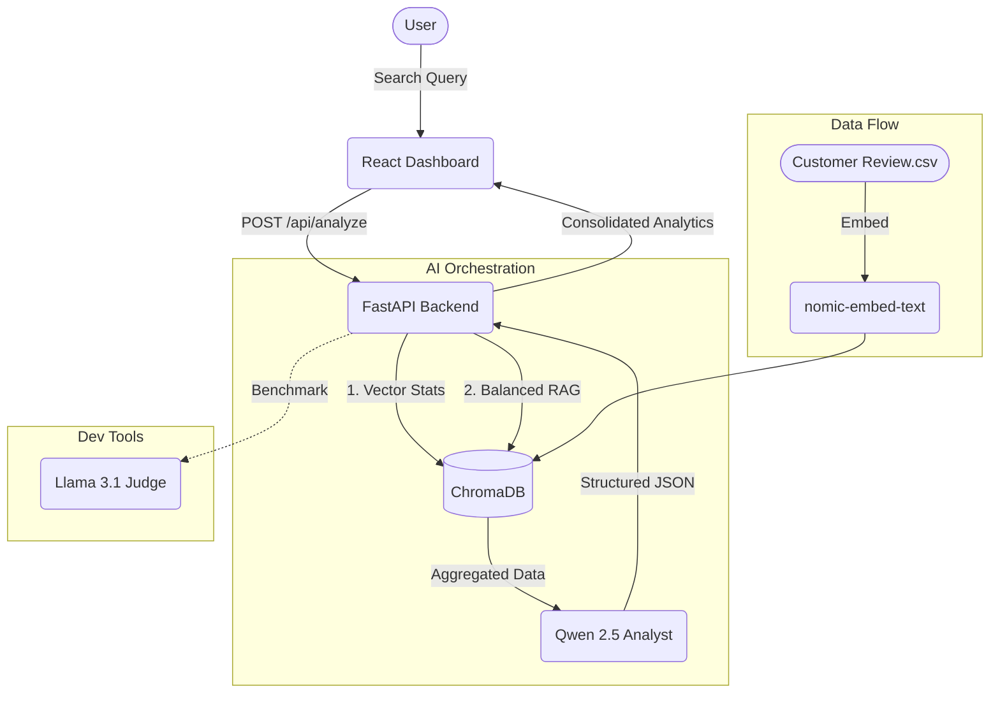

# 📊 InsightAI: Professional Review Analysis Agentic Framework

[](https://www.python.org/downloads/release/python-3130/)
[](https://fastapi.tiangolo.com/)
[](https://react.dev/)
[](https://ollama.com/)

InsightAI is a high-performance, agentic RAG (Retrieval-Augmented Generation) framework that transforms raw e-commerce feedback into high-fidelity business intelligence. Built for scale and truthfulness, it combines local LLM inference with mathematical data aggregation.

---

## 🌟 Key Features

### 🛒 Amazon-Style Intelligence
- **Global Distribution Analytics:** Real-time calculation of 1-5 star distributions and average ratings directly from the semantic vector store.
- **Interactive Deep-Dive:** Click on any rating percentage bar to instantly reveal a scrollable list of the exact raw reviews driving that sentiment.

### 🛡️ Truth-First Architecture
- **Sentiment-Balanced Retrieval:** A custom "3+2" RAG strategy that intentionally fetches a mix of top-relevant and high-criticism reviews to prevent "positivity bias."
- **Anti-Hallucination Protocols:** Strict prompt guardrails that prevent the AI from inventing product flaws or features not explicitly present in the source data.
- **Multi-Agent Quality Audit:** A built-in evaluation suite where **Llama 3.1** acts as a strict "Judge" to audit the accuracy and formatting of the **Qwen 2.5** analyst.

---

## 🏗️ Architecture



---

## 🛠️ Tech Stack

- **Core:** Python 3.13+, FastAPI, CrewAI
- **Database:** ChromaDB (Vector Store)
- **Local LLMs:** Ollama (`qwen2.5:latest`, `llama3.1:latest`)
- **Embeddings:** `nomic-embed-text`
- **UI:** React 18, Vite, Lucide Icons, Modern CSS3

---

## 🏁 Installation & Setup

### 1. Model Preparation (Ollama)
Ensure you have [Ollama](https://ollama.com/) installed and run the following commands to pull the necessary local intelligence:
```bash
ollama pull qwen2.5:latest
ollama pull llama3.1:latest
ollama pull nomic-embed-text
```

### 2. Backend Installation
```bash
cd backend
python -m venv .venv
# Activate:
# Windows: .\.venv\Scripts\activate
# Mac/Linux: source .venv/bin/activate
pip install -r requirements.txt
```

### 3. Data Ingestion
Your vector database must be built before first use. Ensure Ollama is running:
```bash
python ingest_data.py
```

### 4. Running the Dashboard
**Start Backend (Terminal 1):**
```bash
uvicorn main:app --reload
```
**Start Frontend (Terminal 2):**
```bash
cd frontend
npm install
npm run dev
```

---

## 🧪 Evaluation Suite
To verify the system's accuracy and detect hallucinations during development:
```bash
cd backend
python evaluate_results.py
```
This performs a cross-model audit using **Llama 3.1** to grade the **Qwen 2.5** output based on ground-truth database text.

---

## ⚖️ License
Distributed under the MIT License. See `LICENSE` for more information.

---
*Developed for Advanced Agentic AI Research.*
