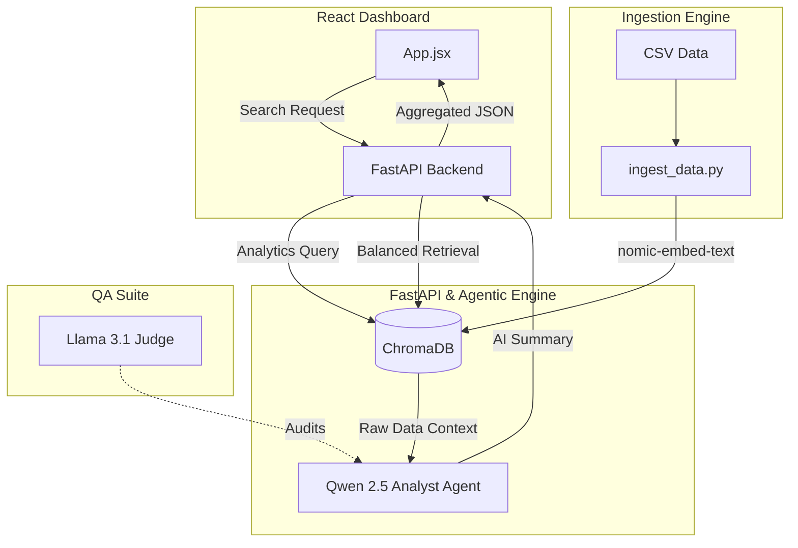

# 🏗️ Technical Architecture: InsightAI

InsightAI is a modular agentic framework that bridges the gap between **Semantic Search (RAG)** and **Statistical Analytics**. This document defines the core architecture and the purpose of every functional unit in the system.

---

## 🗺️ System Architecture Diagram

---

## 📂 Functional Breakdown

### 1. The Ingestion Engine (`ingest_data.py`)
Responsible for transforming raw text into the "Brain" of the project.
- **`main()`**: Coordinates the total workflow: Loading the CSV, sanitizing data, initializing the embedding model, and batch-uploading vectors to ChromaDB.
- **`OllamaEmbeddingFunction`**: A local proxy that converts words into 768-dimensional vectors using the Nomic model.

### 2. The Semantic Brain (`agent.py`)
The logic layer that fetches data and powers the AI Agent.
- **`get_reviews()`**: Implements **Balanced Retrieval**. It performs dual-queries (Top 3 Relevant + Top 2 Critical) to ensure the agent sees a fair mix of positive and negative feedback.
- **`get_rating_distribution()`**: The Math Engine. It scans the nearest 100 reviews to calculate the average rating and the counts for the 5-star to 1-star distribution bars.
- **`build_and_run_crew()`**: The Orchestrator. It fetches the data, configures the `analysis_task` with anti-hallucination rules, and triggers the AI Agent to summarize everything into JSON.

### 3. The API Routing (`main.py`)
The communication bridge between the UI and AI.
- **`get_categories()` / `get_manufacturers()`**: Automatically extracts every unique product category and brand from your CSV so the UI dropdowns are always up to date.
- **`analyze_reviews()`**: The primary bridge. Merges the AI-generated text summary with the mathematical database statistics into a single package for the dashboard.

### 4. The Interactive UI (`App.jsx`)
The presentation layer that makes the data actionable.
- **`handleSearch()`**: Manages the loading states and communicates with the Backend.
- **Star Distribution Logic**: Renders the Amazon-style percentage bars dynamically from the database stats.
- **`selectedStarRating` State**: Handles the "Click-to-Filter" logic, allowing users to expand the dashboard and read original raw reviews on demand.

### 5. The Judge Suite (`evaluate_results.py`)
Our internal developer productivity tool.
- **`evaluate_summary()`**: A "Model-vs-Model" audit. It sends the AI-generated summary to a secondary local model (Llama 3.1) to grade it on truthfulness and formatting.

---

## 🔄 Data Life-Cycle
1. **Input:** User submits a search.
2. **Retrieve:** `agent.py` pulls 100 reviews for math and 5 reviews for text-analysis.
3. **Analyze:** `Qwen 2.5` reads the text and stats to write a summary.
4. **Output:** `main.py` sends a combined JSON package to `App.jsx`.
5. **Interact:** The User views the AI summary and clicks the Bar Charts to verify the source data.
